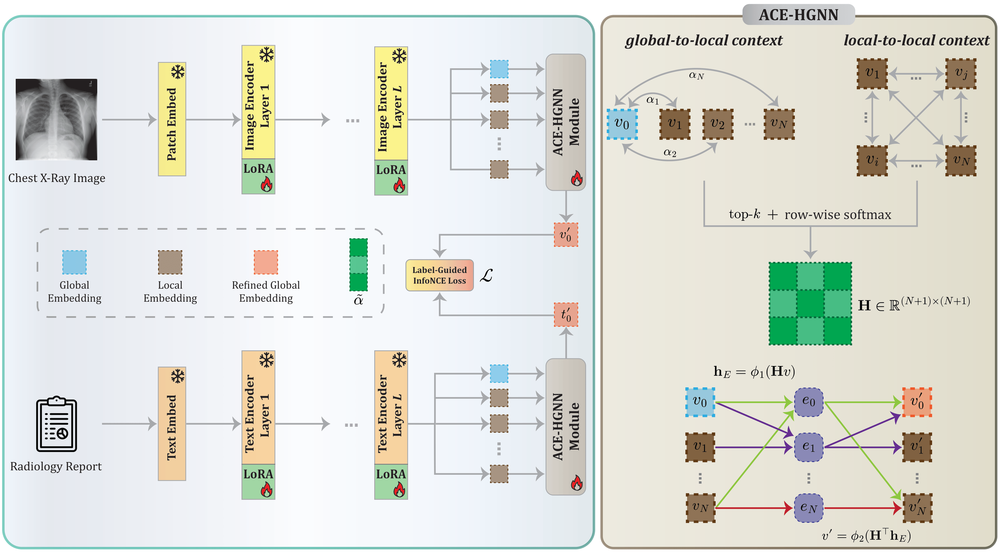

<hr>
<h1 align="center">
  ACE-LoRA <br>
  <sub>Graph-Attentive Context Enhancement for Parameter-Efficient Adaptation of Medical Vision-Language Models</sub>
</h1>

<div align="center">
  <a href="https://github.com/m-arda-aydn" target="_blank">M.&nbsp;Arda&nbsp;Aydın</a><sup>1,2</sup> &ensp; <b>&middot;</b> &ensp;
  <a href="https://github.com/MelihBerkY" target="_blank">Melih&nbsp;B.&nbsp;Yılmaz</a><sup>1,2</sup> &ensp; <b>&middot;</b> &ensp;
  <a href="https://aykut.koc.bilkent.edu.tr/" target="_blank">Aykut&nbsp;Koç</a><sup>1,2</sup> &ensp; <b>&middot;</b> &ensp;
  <a href="https://kilyos.ee.bilkent.edu.tr/~cukur/" target="_blank">Tolga&nbsp;Çukur</a><sup>1,2</sup> &ensp;
  
  <br>
  
  <sup>1</sup>Bilkent University &emsp; <sup>2</sup>UMRAM 

  <br>
  <br>

  <div align="center">
  <a href="https://arxiv.org/pdf/2603.17079"></a>
  <a href="https://huggingface.co/aydnarda/ACE-LoRA"></a>
</div>
</div>
<hr>

> **Abstract:** *The success of CLIP-like vision-language models (VLMs) on natural images has inspired medical counterparts, yet existing approaches largely fall into two extremes: specialist models trained on single-domain data, which capture domain-specific details but generalize poorly, and generalist medical VLMs trained on multi-domain data, which retain broad semantics but dilute fine-grained diagnostic cues. Bridging this specialization–generalization trade-off remains challenging. To address this problem, we propose ACE-LoRA, a parameter-efficient adaptation framework for generalist medical VLMs that maintains robust zero-shot generalization. ACE-LoRA integrates Low-Rank Adaptation (LoRA) modules into frozen image-text encoders and introduces an Attention-based Context Enhancement Hypergraph Neural Network (ACE-HGNN) module that captures higher-order contextual interactions beyond pairwise similarity to enrich global representations with localized diagnostic cues, addressing a key limitation of prior Parameter-Efficient Fine-Tuning (PEFT) methods that overlook fine-grained details. To further enhance cross-modal alignment, we formulate a label-guided InfoNCE loss to effectively suppress false negatives between semantically related image-text pairs. Despite adding only 0.95M trainable parameters, ACE-LoRA consistently outperforms state-of-the-art medical VLMs and PEFT baselines across zero-shot classification, segmentation, and detection benchmarks spanning multiple domains.* 

<div align="center">
  
</div><br/>

## :tada: News
**`2026/03/18` Our paper and code are publicly available.**  

## ⚙️ Installation
We used ```Python 3.10.18``` and ```PyTorch 2.1.0``` using ```cuda 11.8``` in our framework.

Create a Conda environment:
```
conda create -n env_name python=3.10.18
```

Install PyTorch:

```
conda install pytorch==2.1.0 torchvision==0.16.0 torchaudio==2.1.0 pytorch-cuda=11.8 -c pytorch -c nvidia
```

Install remaining dependencies:

```
pip install -r requirements.txt
```
## 💾 Datasets

**MIMIC-CXR:** For pretraining, we use the MIMIC-CXR dataset and exclude lateral images. Access to the dataset is available at the following link (note that you must satisfy the dataset provider’s requirements to download the data): [[`link`](https://physionet.org/content/mimic-cxr-jpg/2.1.0/)] 

**NIH Chest X-ray:** For validation, we use the NIH Chest X-ray dataset. The dataset can be accessed at the following link: [[`link`](https://nihcc.app.box.com/v/ChestXray-NIHCC)]. After downloading, run ```dataset_prep/chestx-ray_14_prep.py``` to split the data and prepare it in the required format.

**CheXpert 5x200:** For zero-shot classification, we use the CheXpert 5×200 dataset. The dataset can be accessed at the following link: [[`link`](https://stanfordmedicine.app.box.com/s/j5h7q99f3pfi7enc0dom73m4nsm6yzvh)].

**RSNA:** We use the RSNA dataset for both zero-shot classification and object detection. The dataset can be accessed at the following link: [[`link`](https://www.kaggle.com/competitions/rsna-pneumonia-detection-challenge/data)]. After downloading, run ```dataset_prep/rsna_dataset_create.py``` to split the data and prepare it in the required format for both tasks.

**SIIM:** We use the SIIM dataset for both zero-shot classification and semantic segmentation. The dataset can be accessed at the following link: [[`link`](https://www.kaggle.com/competitions/siim-acr-pneumothorax-segmentation/data)]. After downloading, run ```dataset_prep/SIIM_generate_class_labels.py``` to prepare the data for zero-shot classification, and ```dataset_prep/SIIM_generate_mask.py``` for semantic segmentation.


## 🚀 Training
To fine-tune the model, run the following command for single-GPU training:
```
python train.py 
``` 
For multi-GPU training, run:

``` 
python train_multi_gpu.py
```

Note that training arguments and paths can be specified using ```run_utils.py``` or ```run_utils_multi_gpu.py```.

## 🧪 Evaluation
We also provide the ACE-LoRA weights trained on the MIMIC-CXR dataset (```checkpoint/ACE_LoRA.pt```). After downloading the datasets, you can directly execute the evaluation scripts for your chosen dataset (RSNA, SIIM, or CheXpert) located in the ```zero_shot_eval``` folder. For example, after setting the appropriate paths, you can run the following command to evaluate the zero-shot performance of ACE-LoRA on the CheXpert 5×200 dataset:

``` 
python zero_shot_eval/zero_shot_eval_ace_lora_chexpert.py
```

## ✒️ Citation
You are encouraged to modify/distribute this code. However, please acknowledge this code and cite the paper appropriately.
```
@article{aydin2026ace,
  title={ACE-LoRA: Graph-Attentive Context Enhancement for Parameter-Efficient Adaptation of Medical Vision-Language Models},
  author={Ayd{\i}n, M Arda and Yilmaz, Melih B and Ko{\c{c}}, Aykut and {\c{C}}ukur, Tolga},
  journal={arXiv preprint arXiv:2603.17079},
  year={2026}
}
```

## 🤝 Acknowledgments
This implementation builds upon [CLIP-LoRA](https://github.com/MaxZanella/CLIP-LoRA) and [LoRA](https://github.com/microsoft/LoRA). We gratefully acknowledge their valuable contributions.

<hr>

Copyright © 2026, ICON Lab.
